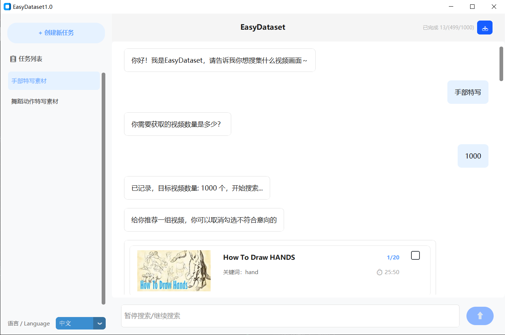
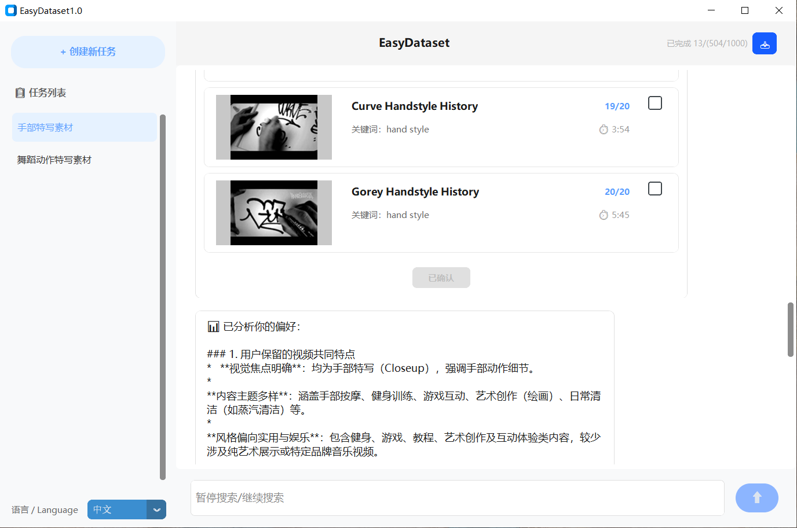
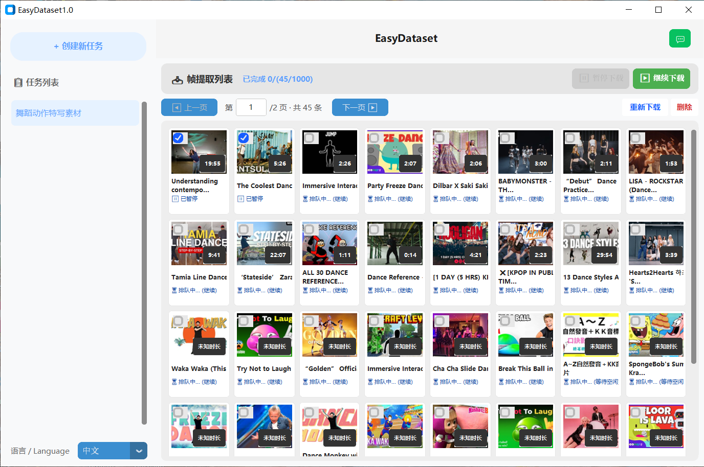

<div align="center">
  <h1>EasyDataset</h1>
</div>

<div align="center">
  <a href="https://huggingface.co/Jonnty/EasyDataset/tree/main">
    
  </a>
</div>

<div align="center">
  <p>
    Automatically collects relevant videos, takes over bulk browser collection, and makes automatic judgments.<br>
    自动搜集获取相关的视频，接管浏览器海量搜集，并自动判别。
  </p>
</div>

## Operation Interface / 操作界面

1. Enter your search target / 输入你想搜索的目标  
2. Enter the target number of videos / 输入目标视频数  
3. For the initially recommended videos, you can uncheck the ones you are not satisfied with. The system will then analyze your preferences and automatically search and recommend suitable videos.  
   对于它首批推荐的视频，可以取消勾选不满意的。它将对你进行偏好分析，后续自动搜索推荐合适的视频。






## Usage / 使用方法

### 1. Windows System / Windows 系统

Download the `system` folder and `_internal.zip` from  
<a href="https://huggingface.co/Jonnty/EasyDataset/tree/main"></a>  
Extract the zip to a folder with the same name.  
Double-click `EasyDataset.exe` to run it without installation.  

从 Hugging Face 下载 `system` 文件夹和 `_internal.zip` 压缩包，解压为同名文件夹，双击运行 `EasyDataset.exe` 免安装使用。

### 2. Run from Code / 代码运行

Download only the `system` folder and place it in the same directory as `easydataset.py`, then run:  

```bash
python easydataset.py
```
仅下载 system 文件夹，放到 easydataset.py 同一路径下，运行 python easydataset.py。

## More Details / 更多信息
HTML5 Canvas is used to capture video frame information.
采用 HTML5 Canvas 获取视频帧信息。

The conversation module uses Qwen3.5-0.8B:
https://huggingface.co/Qwen/Qwen3.5-0.8B/tree/main
对话部分使用的是 Qwen3.5-0.8B。
